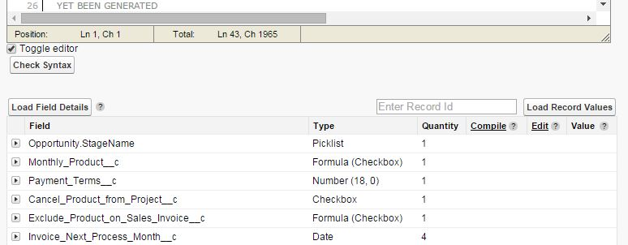

# Overview

The Salesforce Enhanced Formula Editor chrome extension enhances the formula textareas with the Edit Area code editor and provides a Load Field Details button that provides details about the fields found in the formula.

Editor Feature Includes:
- Syntax highlighting
- Tabbing (tab and shift-tab)
- Parenthesis matching
- Find and Replace
- No code wrapping
- Resize editor window by clicking bottom right corner
- Full screen feature
 
A new button is created named "Load Field Details" that loads details about the fields found in the formula.

Field Details Feature Includes:
- Field type
- How many times it is used
- Formula field compile sizes
- Field edit links
- Field record values
- Field Sub Details (shown by clicking the expand arrow)
  - Object Name
  - Field Label
  - Field Help Text
  - For picklist fields, their picklist values
  - For formula fields, their formula

Formula fields found in the formula will load the enhanced editor for their own formulas, even providing the Load Field Details for themselves, which allows you to drill down through all formulas used in the parent formula.
